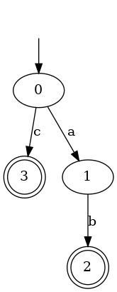

# LParser
Create an automate, which is able to search words in a string, from a regex 

# Graphe
A class to create and to use the automate associated to the regex
Can be draw

# Regex special character

| Symbols |                                          Meanings                                           |
|:-------:|:-------------------------------------------------------------------------------------------:|
|   \|    |                                      is the or symbol                                       |
|   ()    |                                 Specify a sub bloc of regex                                 |
|   \*    |       means the char or the block before can be repeated as much as we want or never        |
|   \+    | means the char or the block before can be repeated as much as we want but at least one time |
|    ?    |                          the char before can be put one or 0 time                           |
|    $    |         means the end of the regex. It automaticly put one at the end of the string         |
|    .    |                               represent all of the character                                |

# LParser methods (Cpp)
|   Definitions   |                                                                                        Descriptions                                                                                        |
|:---------------:|:------------------------------------------------------------------------------------------------------------------------------------------------------------------------------------------:|
|    is_accept    |                                            Tell if a string is generated or not by the regexp. It takes a string or char* and return a boolean                                             |
| export_graphivz |                                                                     Print in the terminal the graph in the dot format                                                                      |
 | found | Return the first substring found which is generated by the regexp or return NULL. It takes a string or char* and you can specify at wich position it must begins the parsing of th estring |

# Struct of the project
There is folder Cpp and Python. Both o them contain the lparser class, one is write in cpp the other in python.
The python contain a show method wich will draw you the graph using matplotlib.
The cpp one is more reliable and contain the export_graphivz which will print in the terminal the graphivz in format.
If you just want to draw some graph you can just use the draw.sh script as:
* ./draw.sh your_regexp_with_no_space_inside

Be aware that the draw.sh script and the show python method only waork on linux ubuntu.
The rest of the functionality work in other systems.

# draw.sh rules
* "Rebuild" or "-rb" will force to rebuild all the project.
* "clean" delete the generated files but do not delete the latest graph picture.
* Rest of strings will be interpreted as a regex. You can put different regexp at the same time. It will generate them one by one.
* If no argument is pass it will print the last graph.

<br>Example:<br/>

```console
thl@forever:~$ ./draw.sh "ab|c"
```
 

# Syntax informations
The parser used on the regex is a LL(1).

* Grammar:
  * Z:
    * S$    (0)
  * S:
    * A     (1)
    * e     (2)
  * A:
    * BCS   (3)
  * B:
    * (A)E  (4)
    * DE    (5) 
  * C:
    * |AC   (6)
    * e     (7)
  * D:
    * .     (8)
    * n     (9)
    * [F    (10)
  * E:
    * \*    (11)
    * ?     (12)
    * \+    (13)
    * e     (14)
  * F:
    * ]     (15)
    * nG    (16)
  * G:
    * -nG   (17)
    * F     (18)

|    Null    |
|:----------:|
|    SCE     |

| State | First |
|:-----:|:-----:|
|   Z   | (.n[  |
|   S   | (.n[  |
|   A   | (.n[  |
 |   B   | (.n[  |
 |   C   |  \|   |
 |   D   |  .n[  |
 |   E   |  *?+  |
 |   F   |  ]n   |
|   G   |  -n]  |

| State |   Follow   |
|:-----:|:----------:|
|   Z   |            |
|   S   |    $)\|    |
|   A   |    $)\|    |
|   B   |  $(.n)\|[  |
|   C   |     (.n    |
|   D   | $(.n)\|*?+[ |
|   E   |  $(.n)\|[  |
|   F   | $(.n)\|*?+[ |
|  G    |            |

| Terminals \ States | Z | S | A | B | C | D  | E  | F  | G  |
|:------------------:|:-:|:-:|:-:|:-:|:-:|:--:|:--:|:--:|:--:|
|         $          | 2 |   |   |   |   |    | 14 |    |    |
|         (          | 0 | 1 | 3 | 4 | 7 |    | 14 |    |    |
|         )          | 2 |   |   |   |   |    | 14 |    |    |
|         *          |   |   |   |   |   |    | 11 |    |    |
|         ?          |   |   |   |   |   |    | 12 |    |    |
|         +          |   |   |   |   |   |    | 13 |    |    |
|         n          | 0 | 1 | 3 | 5 | 7 | 9  | 14 | 16 | 18 |
|         .          | 0 | 1 | 3 | 5 | 7 | 8  | 14 |    |    |
|         \|         | 2 |   |   |   | 6 |    | 14 |    |    |
|         [          |   | 1 |   |   |   | 10 |    |    |    |
|         ]          |   |   |   |   |   |    |    | 15 | 18 |
|         -          |   |   |   |   |   |    |    |    | 17 |